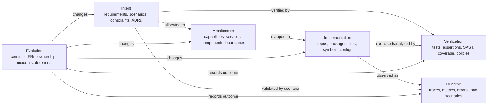
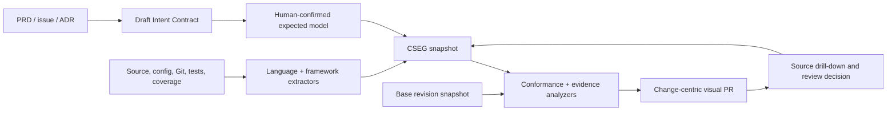
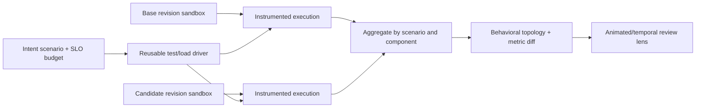
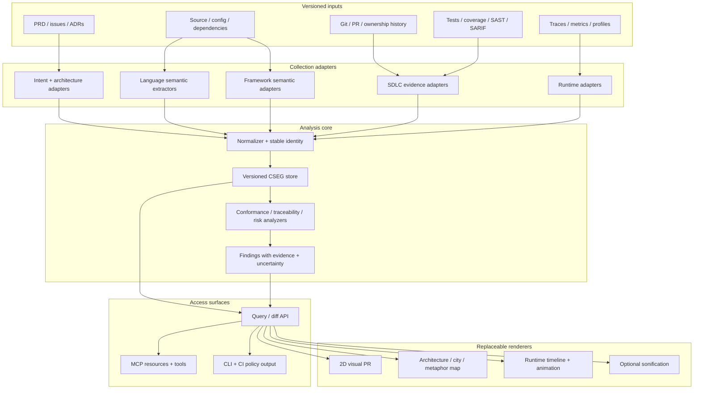

# Visual Governance for AI-Generated Code

## Research, product options, and an implementation direction for VibeCodeMap

**Status:** product/research brief
**Date:** 2026-07-16
**Purpose:** formulate the problem rigorously, test the supplied ideas against existing research and tools, select the three strongest solution directions, and define a credible path to a prototype.

---

## 1. Executive conclusion

The core problem is real, but the strongest formulation is not “AI writes code 100 times faster, therefore code must become 3D.” The defensible problem is:

> Software-generation throughput can grow faster than a team’s ability to reconstruct intent, verify system-level consequences, and retain an accurate mental model. Line-oriented review is necessary for some questions, but it is a poor primary interface for completeness, architecture, cross-cutting behavior, and change impact.

The opportunity is therefore to change the **unit of review**:

- from lines to **claims** about structure and behavior;
- from a diff alone to **intent versus implementation versus evidence**;
- from an undifferentiated whole-codebase picture to **question-specific views of a changed subgraph**;
- from “the tool says this is bad” to **a finding with provenance, confidence, and links to the exact supporting code, test, trace, or decision**.

The recommended product is a **visual evidence and conformance system**, not primarily a code-city renderer. Its shared foundation should be a hierarchical, typed **Software Evidence Graph** that keeps six kinds of information separate but connected:

1. product intent and acceptance scenarios;
2. intended architecture and constraints;
3. statically extracted implementation structure;
4. tests, analysis results, and other verification evidence;
5. observed runtime behavior;
6. change history and review decisions.

The visualization is a set of lenses over that graph. It should answer a review question, then let the reviewer drill down to source. Three product directions can share this foundation:

1. **Intent-to-Evidence Visual PR** — the best first product and MVP;
2. **Scenario Wind Tunnel** — runtime and load-behavior comparison, added second;
3. **Learned Change-Risk Atlas** — an ML-assisted prioritization layer, treated as a research track rather than the foundation.

The “building,” “factory,” “vehicle,” 3D city, physics, and audio ideas are useful as optional representations. They should not define truth or the core data model. The core must remain typed, queryable, versioned, and evidence-backed so renderers can change without rewriting the analyzers.

### Recommended first wedge

Start with a constrained TypeScript web-service ecosystem and answer four questions for every pull request:

1. What capabilities and architecture were expected to change?
2. What components and dependencies actually changed?
3. What expected elements or evidence are missing, and what undeclared elements appeared?
4. Which exact files, symbols, tests, and traces support each conclusion?

Do this first in a stable 2D, change-centric view integrated with CI and pull requests. Add 3D, domain metaphors, animation, and sound only after controlled tests show that they improve a specific task.

---

## 2. The issue, formulated precisely

### 2.1 The oversight-bandwidth gap

Modern code review combines several very different jobs:

| Review job | Typical question | Why a line diff is insufficient |
|---|---|---|
| Local correctness | Is this condition, query, or error path correct? | A diff is often appropriate, but relevant context may be elsewhere. |
| Architectural conformance | Did this change cross a forbidden boundary or create a new coupling? | The fact is relational and often spans many files. |
| Completeness | Did the implementation include every required behavior and control? | Missing code is not present in the diff; an external expectation is required. |
| Behavioral change | Did an important scenario take a different path or become blocking? | Static code describes possibilities; execution evidence describes observed paths. |
| Quality and operational risk | Where did churn, complexity, fan-out, latency, or error exposure grow together? | No single line or metric answers this. |
| Ownership and comprehension | Can the team explain why each new component exists and who owns it? | Code can work while its rationale and traceability are lost. |

AI changes the economics because producing another plausible implementation is cheap while validating its fit with the system remains expensive. The bottleneck is not just reading speed. It is **reconstructing the relationship between intent, structure, behavior, and evidence**.

This matters even if AI delivers only a modest productivity increase. The frequently repeated “10–100x” number is not established by current empirical evidence. A controlled GitHub Copilot experiment reported a 55.8% speedup on a bounded coding task, while METR’s early-2025 randomized study found experienced maintainers took 19% longer with the then-current tools. METR’s February 2026 follow-up found signals of speedup but judged its estimates unreliable because adoption and task-selection effects biased the sample. A 2026 longitudinal study of Cursor adoption reported transient velocity gains alongside persistent complexity/debt increases, but also cautioned that its metrics and open-source setting limit generalization. The correct product premise is therefore **a growing and uneven oversight mismatch**, not a proven universal multiplier. Sources: [Microsoft Research productivity experiment](https://www.microsoft.com/en-us/research/publication/the-impact-of-ai-on-developer-productivity-evidence-from-github-copilot/), [METR early-2025 study](https://metr.org/blog/2025-07-10-early-2025-ai-experienced-os-dev-study/), [METR 2026 update](https://metr.org/blog/2026-02-24-uplift-update/), and [Speed at the Cost of Quality, MSR 2026](https://www.cs.cmu.edu/~ckaestne/pdf/msr26.pdf).

### 2.2 The product objective

The objective is not to maximize how much data can be encoded into one image. It is to maximize **correct human decisions per minute while preserving inspectability and ownership**.

A useful system should let a reviewer:

- orient at project, capability, service, module, file, and symbol levels;
- see only the changed and relevant neighborhood by default;
- compare expected, statically possible, and runtime-observed structures without conflating them;
- find absences only when a requirement, contract, or baseline makes an absence meaningful;
- distinguish a measured fact from an inference and an inference from a guess;
- navigate every visual element to exact evidence;
- record an accepted exception so it does not remain a permanent false alarm;
- give the same structured context to humans, CI policies, and coding agents.

### 2.3 What the product must not claim

This tool cannot prove that an arbitrary codebase is correct, secure, maintainable, or complete. Specifically:

- static analysis does not enumerate all behavior in reflective or dynamic systems;
- a runtime trace shows what executed under a workload, not every possible path;
- coverage measures execution, not assertion quality or correctness;
- complexity, size, and code smells are risk signals, not diagnoses;
- an LLM classification is an inference, not a source of truth;
- an anomaly model detects deviation from its training distribution, not “badness” in the abstract;
- a visual metaphor can reveal patterns but can also manufacture misleading intuitions.

The product should make those limits visible in its data model and interface.

---

## 3. What prior research and existing tools actually support

### 3.1 Visual representations can help, but only for defined tasks

Software visualization is not a failed idea, nor is it a demonstrated replacement for source code. Evidence is task-specific:

- The original controlled evaluation of CodeCity found that a city metaphor could support selected program-comprehension tasks, but the broader literature remains much smaller than the number of proposed visualizations. See [Software Systems as Cities: A Controlled Experiment](https://wettel.github.io/download/Wettel11a-icse.pdf).
- A 2022 controlled study of aggregated runtime traces in a software city reported 11.7% higher correctness and 5.83% less allotted time than a less-aggregated trace view for its tasks. The key contribution was not “3D”; it was **aggregation and task-oriented encoding that reduced clutter**. See [Trace visualization within the Software City metaphor](https://www.sciencedirect.com/science/article/pii/S0950584922001227).
- ReviewVis represents changed classes and methods as a graph. Professional feedback indicated that it helped participants navigate and understand a change set, but its studies were perception-oriented rather than proof that graph review catches more defects. See [Graph-based visualization of merge requests for code review](https://www.sciencedirect.com/science/article/pii/S0164121222001820).
- ChangePrism is a recent change-centric visualization that explicitly separates an overview of change types from exact code details, reinforcing the importance of overview-to-detail rather than a universal static map. See [ChangePrism](https://arxiv.org/abs/2508.12649).
- A 2024 ExplorViz design combines static and dynamic change data in pull-request workflows. Its authors explicitly state that visualization must integrate with existing review procedures, and they report information and rendering scalability limits when multiple datasets are overlaid. See [Visual Integration of Static and Dynamic Software Analysis in Code Reviews](https://arxiv.org/abs/2408.08141).

The design consequence is clear: **change-centric filtering, aggregation, semantic zoom, and workflow integration matter more than dimensionality**. A 3D overview may be one useful view, but a large unfiltered city or graph becomes another hairball.

### 3.2 Expected-versus-actual architecture is a proven concept

Software reflexion models already formalized the essential comparison in 1995. An engineer defines a high-level model and a mapping between source entities and that model; the tool computes where implementation **converges**, **diverges**, or is **absent** relative to the model. The important detail omitted by the supplied Gemini notes is the mapping: this is not generic graph isomorphism between a PRD and a code property graph. A meaningful abstraction function must map low-level entities into high-level components. See [Murphy, Notkin, and Sullivan, Software Reflexion Models](https://www.cs.ubc.ca/~murphy/papers/rm/fse95.html).

Modern Architecture as Code work provides practical formats and pipelines:

- [FINOS CALM](https://calm.finos.org/introduction/what-is-calm/) defines typed nodes, relationships, metadata, controls, and reusable patterns; CALM patterns can generate and validate architectural structures.
- [Structurizr DSL](https://docs.structurizr.com/dsl) defines a C4-based architecture model and multiple static and dynamic views from one source.
- [ArchUnit](https://www.archunit.org/userguide/html/000_Index.html) demonstrates executable architecture rules for Java dependencies, layers, onion architecture, and cycles.
- A 2026 industrial case study found that Architecture as Code remains manual unless teams add regeneration, reverse checks, repository auditing, structured metadata, shared conventions, and CI integration. See [Architecture as Code in Industry](https://www.es.mdu.se/pdf_publications/7350.pdf).

These precedents support an intent/conformance product. They also show why a pretty diagram alone will drift.

### 3.3 Existing products cover pieces, not the full loop

| Tool/approach | Strong at | Missing relative to this vision |
|---|---|---|
| [CodeCharta](https://codecharta.com/docs/overview/introduction/) | Static metrics in a configurable code-city map; local exploration | Requirement traceability, declared architecture, runtime scenarios, and evidence-grade conformance |
| [ExplorViz](https://explorviz.dev/) | Runtime landscapes and software-city research | A complete intent-to-code-to-test evidence model and broad language/framework support |
| [AppMap](https://appmap.io/docs/reference/guides/using-appmap-diagrams.html) | Recorded execution, dependency/sequence/flame views, source links, runtime diffs | Product intent and architectural absence/constraint reasoning |
| [CodeScene](https://codescene.digitgaming.com/docs/guides/technical/hotspots.html) | Change hotspots, temporal coupling, code health and goals | Fine-grained intent/implementation/runtime conformance |
| CALM / Structurizr | Versioned declared architecture and views | Automatic, high-fidelity reverse mapping from arbitrary implementation and runtime evidence |
| ArchUnit and dependency rules | Deterministic architecture enforcement | Completeness, behavior, requirement evidence, and an integrated visual review experience |
| CodeQL / Joern / Semgrep | Program/data-flow and security analysis | Product intent, team-specific architectural meaning, and holistic review workflow |

The differentiation is not “we also draw dependencies.” It is the **continuous trace from requirement and decision to implementation, verification, observed behavior, and review outcome**.

### 3.4 Static and dynamic evidence are complementary

The supplied notes sometimes treat static analysis as false and runtime telemetry as truth. Neither is sufficient:

- static analysis approximates possible structures and flows but struggles with reflection, framework magic, dependency injection, generated code, and dynamic dispatch;
- dynamic analysis gives precise observations for the paths that executed, but unexecuted behavior remains unknown and sampling or missing instrumentation creates gaps;
- load tests validate only their environment, workload, data distribution, and duration;
- OpenTelemetry represents operations as spans with parent/child relationships and links, but it records only instrumented operations and is subject to sampling. See the [OpenTelemetry tracing specification](https://opentelemetry.io/docs/specs/otel/trace/api/).

The interface must visibly distinguish:

- **declared** intent or architecture;
- **statically extracted** possible relation;
- **runtime observed** relation;
- **verified** claim supported by a test or policy;
- **inferred** semantic relation proposed by a model.

### 3.5 Metrics need context

The physical metaphors—mass, heat, density, friction—are promising if they encode defensible signals. They are dangerous when they turn proxies into verdicts.

- A large study of 100 Java projects found code coverage had insignificant project-level correlation and no file-level correlation with post-release bugs. Coverage remains useful for identifying unexecuted code, but “smooth metal = high quality” is not valid. See [Code Coverage and Postrelease Defects](https://doi.org/10.1109/TR.2017.2727062).
- Code-smell studies find some associations with change- and fault-proneness, while also showing that smell counts are strongly confounded by size and that expert judgment remains more flexible. See [Code smells as system-level indicators of maintainability](https://doi.org/10.1016/j.jss.2013.05.007) and [Palomba et al.](https://link.springer.com/article/10.1007/s10664-017-9535-z).
- Aggregating method metrics by summation can inflate relationships between size and complexity. See [The Use of Summation to Aggregate Software Metrics](https://rebels.cs.uwaterloo.ca/journalpaper/2016/07/23/the-use-of-summation-to-aggregate-software-metrics-hinders-the-performance-of-defect-prediction-models.html).

A better “heat” signal combines several contextual factors—for example, recent churn, dependency centrality, complexity growth, low scenario evidence, and incident history—and exposes the factors rather than presenting an unexplained health score.

### 3.6 Sonification is promising but not ready as the main interface

Research prototypes show that auditory cues can complement visualization for some program-comprehension and debugging tasks, particularly after training. Other experiments found auditory-only tools less effective for sighted users and multimedia benefits dependent on practice. The evidence base is small, mappings are task-specific, and continuous sound can increase rather than reduce cognitive load. Sources: [Sonification Design Guidelines to Enhance Program Comprehension](https://people.cs.vt.edu/tilevich/papers/sonification.pdf) and [Using Spoken Text to Aid Debugging](https://digitalcommons.cwu.edu/compsci/20/).

Sound should initially be:

- optional and user-triggered;
- used for temporal changes, threshold crossings, or accessibility;
- paired with a visible explanation;
- evaluated as a separate interaction hypothesis.

It should not turn a blended “quality score” into harmony or dissonance. That creates an emotionally persuasive but scientifically opaque judgment.

### 3.7 Graph learning is technically plausible, but it is not the MVP

Code Property Graphs combine syntax, control flow, and program/data dependence in one typed graph and are a strong analysis substrate. [Joern’s specification](https://cpg.joern.io/) and the original [Code Property Graph paper](https://fabianyamaguchi.com/files/2014-ieeesp.pdf) support this. Repository-level code graphs also improve agent navigation in work such as [RepoGraph](https://proceedings.iclr.cc/paper_files/paper/2025/hash/4a4a3c197deac042461c677219efd36c-Abstract-Conference.html).

GNNs, graph pooling, link prediction, and anomaly detection are legitimate research directions. However:

- code already has a known hierarchy—symbol, file, package, service—so learning that hierarchy with DiffPool adds complexity and can discard semantics;
- DiffPool’s soft assignment structures are expensive for large graphs and were not designed as a whole-enterprise-codebase interactive index;
- “healthy repository” labels are not objective, stable, or domain-neutral;
- synthetic sabotage can train a model to recognize the mutation generator’s artifacts rather than real AI-induced failures;
- link prediction can suggest a statistically common missing edge, but cannot know that authentication is required unless intent or policy says so;
- [GNNExplainer](https://arxiv.org/abs/1903.03894) identifies a predictive subgraph and feature subset; it does not prove that five source lines caused an architectural defect;
- later work has documented faithfulness and stability concerns for graph explanation methods. See [Probing GNN Explainers](https://arxiv.org/abs/2106.09078).

ML should rank where a reviewer looks and propose hypotheses. Deterministic evidence and explicit contracts should remain responsible for hard gates.

---
## 4. Design principles

### Principle 1: analyze first, render second

The analyzer should produce a renderer-independent intermediate representation. A 2D graph, matrix, city, building, factory, timeline, and audio renderer must all consume the same typed facts. Otherwise every visual experiment requires rebuilding the parser and every metaphor silently changes the meaning of the analysis.

### Principle 2: preserve epistemic status

Every node, edge, metric, and finding needs a provenance class:

| Class | Meaning | Example |
|---|---|---|
| Declared | Authored and accepted by a human or policy | `Orders API must require customer authentication` |
| Deterministic extraction | Derived by a reproducible parser or tool | `orders.ts imports db/orderRepository.ts` |
| Static approximation | A conservative or incomplete program-analysis result | `request.body may flow to query argument` |
| Observed | Recorded in a named execution and environment | `checkout scenario emitted 14 SQL spans` |
| Inferred | Proposed by an LLM or statistical model | `this module probably implements discount policy` |
| Decided | Human accepted, rejected, waived, or superseded a finding | `direct read is an accepted migration exception until ADR-18 expires` |

“Confidence 82%” is not enough. The user needs to know **what process produced the claim**. LLM verbalized confidence is not reliably calibrated without task-specific validation; current research finds capability and uncertainty quality can diverge. See [Can LLMs Express Their Uncertainty?](https://proceedings.iclr.cc/paper_files/paper/2024/hash/6733cf15e10e2cd1d59af033c3bb8507-Abstract-Conference.html) and [On Calibration of Pre-trained Code Models](https://conf.researchr.org/details/icse-2024/icse-2024-research-track/124/On-Calibration-of-Pre-trained-Code-models).

### Principle 3: compare four models, not two

“Expected versus actual” is too coarse. The system needs four distinguishable layers:

1. **Expected:** requirements, constraints, planned components, scenarios, budgets.
2. **Declared implementation mapping:** which code areas the team says realize each expected element.
3. **Extracted possibility model:** dependencies, endpoints, data flows, handlers, persistence, and other relations found statically.
4. **Observed behavior model:** paths, timings, errors, and resource interactions recorded for named scenarios.

A fifth layer—verification evidence—connects claims in all four models to tests, policies, analysis findings, and review decisions.

This prevents common category errors. A queue publish found statically is possible behavior, not proof that a message is delivered. A trace without a queue call does not prove the code can never publish. An expected component without a declared mapping is not automatically missing code; it may first be a traceability gap.

### Principle 4: changed subgraph first, whole map second

The default review unit should be:

> changed nodes + changed edges + one or two dependency hops + linked requirements/scenarios/evidence.

The whole codebase remains available for orientation and impact analysis. This avoids turning a 100x codebase into a 100x hairball. Edges should be bundled or aggregated until a reviewer selects a path.

### Principle 5: one visual question per lens

The same spatial layout can support several lenses, but each lens should use color, size, texture, and animation for a single explicit question. Do not simultaneously encode complexity, coverage, churn, ownership, defects, conformance, and latency into one building.

Examples:

- **Conformance lens:** expected, convergent, divergent, absent, uncertain.
- **Change lens:** added, removed, modified, unaffected, blast radius.
- **Evidence lens:** unlinked, implemented, tested, observed, accepted.
- **Runtime lens:** throughput, latency, error, queueing for one scenario.
- **Risk lens:** ranked, explained review priority.
- **Security flow lens:** sources, sanitizers, trust boundaries, sinks.

### Principle 6: every mark must pay rent

Every visual encoding must either answer a review question or support navigation. Decorative motion, arbitrary 3D depth, and metaphorical realism are liabilities if they do not improve accuracy, speed, or retention.

### Principle 7: keep source code as the final evidence surface

The goal is not “never open an editor.” The goal is to make source inspection **selective and hypothesis-driven**. Every component, relationship, and finding should link to exact repository, revision, file, symbol, and line range where possible.

### Principle 8: human intent is versioned data

An LLM may draft expected architecture from a PRD, but the draft becomes authoritative only after human confirmation. The system must support hard constraints, soft preferences, alternatives, exclusions, and unknowns. Otherwise it converts ambiguous product prose into false precision.

---

## 5. The shared foundation: a Canonical Software Evidence Graph

This report uses **CSEG** as a working name for the product’s renderer-independent intermediate representation. It is not proposed as a new industry standard. It should import and export existing standards where practical, especially CALM/C4 for architecture, SARIF for static findings, LCOV/Istanbul for execution coverage, OpenTelemetry for traces, and source-control metadata for evolution.

### 5.1 Six connected strata



### 5.2 Node hierarchy

The hierarchy should be explicit instead of learned:

```text
portfolio / organization (later)
└── project / product
    ├── capability
    │   ├── scenario
    │   └── requirement / constraint
    └── system
        └── service / deployable
            └── module / component
                └── file
                    └── symbol / endpoint / handler / query
                        └── source range
```

Not every ecosystem exposes every level. A small application may map project → module → file → symbol. A microservice estate may add environment, cluster, and deployment nodes. The visualizer uses semantic zoom to reveal levels rather than rendering every node simultaneously.

### 5.3 Core node types

| Stratum | Suggested node types |
|---|---|
| Intent | objective, requirement, acceptance criterion, scenario, non-functional budget, exclusion, risk, ADR, policy |
| Architecture | actor, capability, system, service, component, interface, trust boundary, datastore, queue/topic, external dependency |
| Implementation | repository, package, directory, file, class, function, route, handler, job, schema, configuration, migration |
| Verification | unit/integration/e2e/load test, assertion, coverage region, mutation result, static finding, architecture rule, policy result |
| Runtime | scenario run, trace, aggregated path, span group, metric sample, error event, queue observation, resource profile |
| Evolution | commit, pull request, issue, author/agent, owner, review, waiver, incident, rollback, release |

### 5.4 Core edge types

Edges are typed and directional. Useful initial relations include:

- `contains`, `composed_of`, `owns`;
- `implements`, `allocated_to`, `mapped_to`;
- `imports`, `depends_on`, `calls`;
- `reads`, `writes`, `queries`;
- `publishes`, `subscribes`, `schedules`;
- `authenticates_with`, `authorized_by`, `validates_with`;
- `crosses_boundary`, `exposes`, `consumes`;
- `verified_by`, `exercised_by`, `covered_by`, `observed_in`;
- `requires`, `forbids`, `allows`, `violates`;
- `changed_by`, `reviewed_by`, `introduced_by`, `supersedes`;
- `supports`, `contradicts`, `waived_by`.

An edge also has modality and provenance. For example, a relation can be `calls / static-possible`, `calls / runtime-observed`, or `calls / declared-expected`. These must not collapse into one boolean.

### 5.5 Required properties

Every graph entity should carry at least:

```json
{
  "id": "stable/project-relative/id",
  "kind": "component",
  "level": "module",
  "name": "Order application service",
  "revision": "git-sha-or-intent-version",
  "valid_from": "timestamp-or-revision",
  "provenance": {
    "class": "deterministic-extraction",
    "producer": "typescript-adapter@0.1.0",
    "source_refs": ["src/orders/service.ts#L12-L144"]
  },
  "confidence": null,
  "attributes": {},
  "tags": []
}
```

`confidence` is null for deterministic facts. Inferred facts should include a calibrated model/version, evidence inputs, and the threshold or review decision that accepted them.

### 5.6 Conformance states

The reflexion-model vocabulary can be expanded into review states that distinguish implementation from evidence:

| State | Definition | Default visual treatment |
|---|---|---|
| Convergent | Expected element/relation is mapped and found | stable solid mark |
| Implemented, unverified | Found and mapped, but required evidence is absent | solid component with incomplete evidence ring |
| Expected, unmapped | Intent exists but no code mapping has been declared | ghost outline, neutral warning |
| Absent with evidence | Expected element is mapped but extraction/test/runtime evidence indicates it is missing | ghost outline, high-attention marker |
| Divergent | Actual element or relation violates an explicit constraint | highlighted unexpected mark |
| Undeclared | Actual element or relation has no expected/intended counterpart | new neutral mark until classified; not automatically an error |
| Unobserved | Statically possible behavior did not appear in selected scenarios | muted runtime state, not “dead” |
| Uncertain | Analyzer or semantic mapper cannot resolve the relation reliably | ambiguity texture or badge, never red failure |
| Accepted deviation | Human approved a documented exception with owner/expiry | distinct decision marker |
| Stale intent | Code/runtime changed after the relevant intent mapping was last validated | version-skew marker |

### 5.7 Why a graph, but not necessarily a graph database

The domain is relational, so a graph model is natural. An MVP does not need Neo4j or a distributed graph platform. A versioned set of node and edge tables in SQLite/PostgreSQL plus indexed source artifacts is sufficient for initial repositories and keeps deployment simple. The API can expose graph queries while storage remains replaceable. A dedicated graph engine should be introduced only after measured query or scale requirements justify it.

---

## 6. A disciplined visual and sensory grammar

### 6.1 Stable spatial model

Use position for the one relationship people remember best: **containment and architectural responsibility**.

- Top-level lanes or regions represent business capability, bounded context, or service ownership.
- Nested regions represent service → module → file → symbol.
- External systems and actors remain outside the project boundary.
- Trust boundaries are explicit regions, not inferred from color.
- Layout is stable across revisions; unchanged components should not jump because a metric changed.

This provides spatial memory without requiring a literal city. A city or building renderer can project the same regions later.

### 6.2 Visual channels

| Visual channel | Recommended semantic | Constraint |
|---|---|---|
| Position | containment, ownership, layer/boundary | stable across lenses and versions |
| Shape/icon | component kind: UI, service, queue, datastore, external actor | small fixed vocabulary; always labeled |
| Edge geometry | typed relationship | bundle by default; expand selected paths |
| Edge style | expected/static/observed modality; sync/async only when evidenced | never infer async from animation alone |
| Color | the active lens’s primary state | one categorical or scalar meaning at a time |
| Size | selected quantitative measure such as changed LOC or fan-in | optional, normalized, and labeled |
| Texture/pattern | diff or evidence status when color is occupied | use sparingly and accessibly |
| Opacity | context versus focus, or unobserved in a selected scenario | never use as the sole warning encoding |
| Animation | observed temporal sequence, throughput, queue buildup | pausable; only runtime evidence moves |
| Sound | optional temporal anomaly or accessible selected-path summary | user-triggered and paired with text |

### 6.3 The six initial lenses

#### Lens A: Change and blast radius

Shows the changed subgraph, new/removed relations, directly affected requirements, tests, owners, and one-hop dependents. The reviewer can expand impact paths on demand.

#### Lens B: Intent and conformance

Overlays expected elements and constraints with declared mappings and static extraction. Ghost elements represent expected-but-unmapped or evidence-backed absence; the UI must distinguish those two.

#### Lens C: Requirement evidence

Each requirement/scenario has a segmented evidence ring or small matrix showing:

- implementation mapping;
- automated verification;
- negative/error-path verification;
- runtime observation where required;
- human review/decision.

This is more truthful than painting a component “90% complete.” Completeness is multidimensional and requirements may carry different evidence obligations.

#### Lens D: Runtime scenario

Shows one named use case or workload at a time. Animated flow represents observed calls or messages; speed and thickness have explicit units such as requests/second and p95 latency. Baseline and candidate paths can be aligned or overlaid.

#### Lens E: Risk hotspot

Ranks changed components using transparent factors such as churn, new cross-boundary edges, centrality, complexity growth, weak evidence, incident history, and semantic novelty. Selecting a hotspot shows the factors and raw values.

#### Lens F: Security/data flow

Shows selected entry points, trust boundaries, validation/sanitization, authorization, sensitive data, and sinks. This is a focused subway/path view, not the entire dependency graph.

### 6.4 Concrete inference examples

#### Is a service synchronous or asynchronous?

Do not assign one permanent property to an entire service. A service can participate in both modes.

- A route calling another HTTP service and waiting for its response is a request/response edge even if the implementation uses an `async` language construct.
- Publishing to a recognized queue/topic is an asynchronous handoff edge.
- A background worker consuming that topic is a separate subscription edge.
- A runtime trace may confirm the request path; message causality may require span links rather than a simple parent/child edge.
- If the framework adapter is uncertain, label the relation inferred and show the supporting symbol/configuration.

The visual should encode modality on each edge, not make the whole building spin.

#### Is there persistence?

Evidence can include:

- declared datastore and schema/migration;
- imports or resolved calls to an ORM/repository client;
- static read/write/query relations;
- observed database spans in a scenario;
- persistence tests or migration checks.

A datastore block without any mapped or observed access is an evidence gap. A direct UI-to-database edge is a possible boundary violation only if the architecture forbids it.

#### Is authentication/authorization missing?

A high-confidence finding requires more than “the analyzer did not see auth”:

1. intent or policy marks the endpoint/scenario as protected;
2. the framework adapter resolves the route and its middleware/guard chain;
3. no accepted inherited/global policy satisfies the requirement;
4. optionally, a negative test or runtime probe shows an unauthenticated request succeeds.

The visual can then show the expected security control as a ghost element and link to the route, policy, and failing/missing test. Public endpoints must be explicitly representable so absence is not misclassified.

#### How much is tested?

Show several separate claims:

- code executed by tests (coverage);
- requirement linked to at least one test;
- relevant branch/error path executed;
- assertion or mutation strength, if available;
- test result and recency;
- runtime scenario observed.

Coverage texture alone must never mean “good quality.”

### 6.5 Domain metaphors as skins

The user’s metaphors are valuable when they improve recognition:

- web application → building;
- data pipeline → factory;
- game/client system → vehicle or stage;
- multi-service platform → campus or transit map.

Implement these as **renderer packs** over stable component types and relations. A datastore remains a datastore in every skin; only its representation changes. This lets the team test whether a “warehouse” communicates persistence better than a labeled database icon without corrupting the analysis layer.

### 6.6 What audio can safely encode first

The first audio experiment should use a selected runtime scenario, not ambient whole-codebase quality:

- pulse rate → observed request rate;
- tone duration → latency bucket;
- spatial position → selected service lane;
- a short earcon → error threshold or queue saturation crossing;
- silence → no observed event, clearly labeled as unobserved rather than healthy.

Users should be able to scrub the same time series visually and hear it on demand. Continuous “harmonious code versus dissonant code” should be deferred because the mapping blends contested metrics into an uninspectable emotional signal.

---


## 7. Development workflow: intent, agent, evidence, review

### 7.1 Before implementation: turn prose into reviewable intent

The product should include a **feature-clarification skill**. Its job is not to produce code or unilaterally design architecture. It converts a PRD or conversation into a draft Intent Contract with explicit unknowns.

Minimum fields:

```yaml
feature:
  id: FEAT-order-cancellation
  objective: Allow an authenticated customer to cancel an unfulfilled order.
  out_of_scope:
    - partial item cancellation
    - cancellation after fulfillment begins

requirements:
  - id: REQ-cancel-01
    statement: Only the owning customer or support role may cancel an order.
    priority: must
    evidence_required:
      - implementation_mapping
      - authorization_test
      - negative_test

scenarios:
  - id: SCN-cancel-happy
    actor: authenticated_customer
    given: order is owned by actor and status is pending
    when: POST /orders/{id}/cancel
    then:
      - order status becomes cancelled
      - OrderCancelled event is published
    budgets:
      p95_latency_ms: 300

architecture:
  expected_components:
    - orders_api
    - cancellation_policy
    - order_repository
    - order_events
  expected_relations:
    - from: orders_api
      to: cancellation_policy
      mode: in_process
    - from: cancellation_policy
      to: order_repository
      mode: request_response
    - from: cancellation_policy
      to: order_events
      mode: async_publish
  forbidden_relations:
    - from: orders_api
      to: database
      direct: true
  flexibility:
    cancellation_policy: soft
    authorization: hard

unknowns:
  - whether support cancellation requires a separate endpoint
```

This is deliberately not a complete formal specification. It captures only decisions needed for generation and review. Each item has hard/soft status so the tool does not treat every suggested component as mandatory geometry.

### 7.2 Human confirmation

The user reviews a small baseline diagram and an evidence checklist before implementation begins. The tool asks about unresolved decisions that materially alter the shape. Once accepted, the Intent Contract is versioned with the feature or pull request.

### 7.3 During agent development

The coding agent can query the same model:

- Which components may implement this requirement?
- Which dependencies are forbidden?
- What evidence is still required?
- What existing patterns implement similar scenarios?
- Did my latest change introduce an undeclared boundary crossing?

Analysis can run incrementally after meaningful edits. The agent receives concise structural findings rather than an image or an enormous raw graph.

### 7.4 At pull-request time

The PR view should open with a decision summary:

1. changed requirements/scenarios;
2. structural delta and blast radius;
3. missing or stale mappings;
4. explicit conformance violations;
5. evidence gaps;
6. runtime scenario differences, if available;
7. ranked places that still require source review.

The reviewer then drills from capability → component → file → symbol → source diff. A conventional line diff remains available throughout.

### 7.5 After review

Review outcomes become graph data:

- accepted mapping;
- rejected or fixed finding;
- approved deviation with rationale, owner, and expiry;
- changed intent or ADR;
- test/trace accepted as evidence;
- human-reviewed source range or component.

This prevents the tool from repeatedly rediscovering the same intentional exception and creates project-specific data for later risk models.

### 7.6 MCP and skills: interface, not enforcement engine

MCP is useful for exposing the graph and analyzers to coding agents. It does not itself parse code, render a UI, or enforce a merge gate. CI policy and repository permissions perform enforcement.

Suggested read-mostly MCP resources:

- `vcm://project/current/intent`
- `vcm://project/current/architecture`
- `vcm://project/current/evidence-graph`
- `vcm://review/{review-id}/delta`
- `vcm://review/{review-id}/findings`
- `vcm://scenario/{scenario-id}/latest-comparison`

Suggested tools:

| Tool | Function | Default risk |
|---|---|---|
| `vcm_analyze_workspace` | extract/update static and SDLC evidence | read-only |
| `vcm_diff` | compare revisions or intent versions | read-only |
| `vcm_query` | run bounded typed graph queries | read-only |
| `vcm_trace_requirement` | return implementation, test, runtime, and decision links | read-only |
| `vcm_explain_finding` | return rule, evidence, uncertainty, and source refs | read-only |
| `vcm_propose_mapping` | use semantic inference to suggest code-to-intent links | proposes data; human confirmation required |
| `vcm_run_scenario` | execute a named test/load scenario in a sandbox | stateful/expensive; explicit policy required |
| `vcm_record_decision` | accept/reject/waive a finding with rationale | durable write; authenticated human approval |

Suggested skills/workflows:

- clarify feature intent;
- define or revise architecture constraints;
- review structural delta;
- close requirement-evidence gaps;
- investigate a runtime regression;
- prepare an evidence-backed review summary.

Security defaults should be local-first, least-privilege, and read-only. Running agent-generated code is a separate sandboxed service. MCP’s own security guidance warns that local servers execute with client privileges and recommends explicit consent and sandboxing. See [MCP Security Best Practices](https://modelcontextprotocol.io/docs/tutorials/security/security_best_practices). The current MCP primitives—resources, tools, and prompts—are described in the [official server overview](https://modelcontextprotocol.io/specification/2025-06-18/server/index).

---

## 8. Top three solution directions

These are not mutually exclusive companies. They are three products/layers built on one evidence graph. Ranking reflects feasibility and value as a first release.

### 8.1 Rank 1 — Intent-to-Evidence Visual PR

#### Product promise

For each feature and pull request, show what was intended, what structurally changed, what is unsupported or out of place, and what evidence exists—then link every conclusion to source.

#### Core pipeline



#### What it catches well

- expected component or relation without a mapping;
- mapped component missing from the candidate revision;
- new dependency crossing an explicit layer or trust boundary;
- circular dependencies and unexpected fan-out growth;
- implementation with no linked requirement;
- requirement with implementation but no required test/evidence;
- scope growth and undeclared infrastructure;
- stale architecture or ADR links;
- suspicious placement, when project rules define placement.

#### What it does not catch alone

- subtle algorithmic bugs;
- races, deadlocks, memory leaks, and production-only behavior;
- semantic correctness of business rules without executable or human evidence;
- missing requirements that nobody expressed;
- architecture flaws that are present in both the baseline and the intended model.

#### Pros

- Directly addresses completeness, drift, ownership, and review context.
- Reuses established ideas: traceability, reflexion models, Architecture as Code, architecture tests, and visual PRs.
- Provides deterministic value before ML exists.
- Fits existing Git/CI workflows and can fail rules independently of the visual UI.
- Produces structured context for humans and agents.
- Can start static and local, with lower infrastructure and security risk.

#### Cons

- Intent and mappings impose an authoring/maintenance tax.
- Dynamic frameworks require adapters and may create false absences.
- A new project with vague intent has little baseline truth.
- Teams may encode an already-poor architecture and enforce it perfectly.
- Too many hard constraints can freeze useful evolution.

#### Key mitigation

Treat mapping and intent as first-class UX. Auto-suggest mappings, preserve hard/soft distinctions, show uncertainty, and make accepted deviations cheap to record. A five-minute intent review that saves thirty minutes later is viable; a second architecture bureaucracy is not.

#### Why it is first

It answers the user’s central “what is missing, done, and out of place?” question using explicit expectations and inspectable evidence. It also creates the shared data and labels required by both runtime comparison and ML.

---

### 8.2 Rank 2 — Scenario Wind Tunnel

#### Product promise

Run named acceptance and load scenarios against the base and candidate revisions, then show how the actual execution topology, latency, errors, database work, and queue behavior changed.

#### Core pipeline



#### Evidence sources

- acceptance/E2E tests and deterministic fixtures;
- OpenTelemetry traces and metrics;
- application profiles and database query events;
- queue metrics and consumer lag where available;
- k6/JMeter/Locust-style load generation;
- optional eBPF observations for system-level network, scheduling, and resource behavior.

eBPF is not “absolute truth” and does not automatically understand every application-level call, allocation, or business operation. It is an additional observer whose semantic resolution depends on probes, symbols, runtime, permissions, and kernel/platform support.

#### What it catches well

- changed call or message paths for a scenario;
- unexpected service or datastore fan-out;
- N+1-like query multiplication visible under the scenario;
- latency and error regressions;
- blocking request/response bottlenecks;
- queue buildup, consumer lag, and retry storms when instrumented;
- work that moved across a trust or network boundary;
- missing execution of an expected scenario component.

#### What it does not catch alone

- paths not exercised by the workload;
- rare concurrency failures not triggered during the run;
- production data distributions and infrastructure effects not reproduced in the sandbox;
- conceptual completeness beyond the declared scenarios;
- a security flaw that produces no observable anomaly under the test.

#### Pros

- Represents behavior rather than inferring it entirely from source.
- Gives animation and “physics” a defensible data basis.
- Makes performance budgets and architecture concrete at review time.
- Reuses existing tests as scenario drivers.
- Offers strong differentiation when combined with intent and static structure.

#### Cons

- Requires the candidate to build and execute.
- Running untrusted AI code needs isolation, resource limits, secrets control, and network policy.
- Instrumentation and realistic fixtures are ecosystem-specific.
- Trace volume, sampling, and aggregation are substantial engineering problems.
- Results can create false confidence if scenario coverage is hidden.
- Base-versus-candidate environments must be controlled to make comparisons meaningful.

#### Key mitigation

Start with deterministic integration/E2E scenarios in CI, not production-wide observability or arbitrary eBPF. Show scenario coverage and instrumentation gaps alongside every result. Animate aggregated component paths, not individual spans.

#### Why it is second

It is the strongest answer to sync/async flow, bottleneck, load, and “engine sound” ideas, but it becomes useful only after scenarios, component identities, and source mappings exist. The first product creates that foundation.

---

### 8.3 Rank 3 — Learned Change-Risk Atlas (“Code MRI,” corrected)

#### Product promise

Rank changed components and paths by the probability that they deserve human attention, explain the contributing evidence, and improve from project-specific review and defect outcomes.

#### Correct formulation

Do not train a model to make good repositories look like symmetric crystals. Train a model for a measurable decision:

> Given a proposed change and the project state at that time, which changed subgraphs are most likely to cause high review effort, a rejected review finding, a test/CI failure, rollback, incident, or near-term corrective change?

The model output is a **review priority**, not a quality verdict.

#### Candidate features

- size and dispersion of the change;
- new/removed typed dependency edges;
- boundary violations and conformance deltas;
- fan-in/fan-out and centrality change;
- code churn and hotspot history;
- ownership concentration and unfamiliarity;
- complexity delta, not just absolute complexity;
- evidence gaps and changed test reach;
- semantic novelty relative to the component’s history;
- runtime path/latency/error delta when available;
- prior review comments, incidents, rollbacks, and corrective commits.

#### Model sequence

1. Start with transparent rules and a regularized linear or gradient-boosted ranking model.
2. Calibrate scores on a temporal validation set.
3. Evaluate project-held-out and ecosystem-held-out performance.
4. Add graph features and only then test whether a GNN materially improves top-k recall and calibration.
5. Use graph explanations as hypotheses, validated against raw evidence—not as causal proof.

A 2026 study of 33,707 agent-authored PRs reported that structural features predicted high review effort much better than semantic text features in its dataset, suggesting that a lightweight structural triage model is a credible first experiment. It is one study and its labels capture review effort, not correctness. See [Early-Stage Prediction of Review Effort in AI-Generated Pull Requests](https://arxiv.org/abs/2601.00753).

#### Training data strategy

Prefer, in order:

1. project-specific historical changes with real review/test/incident outcomes;
2. ecosystem-level public PRs with strong review histories;
3. carefully labeled real defects and architecture violations;
4. synthetic mutations only as robustness tests or pretraining, never the sole evaluation set.

Synthetic sabotage is useful for generating controlled counterexamples, but the final test set must contain naturally occurring changes that the mutation generator never saw.

#### Pros

- Prioritizes scarce human attention rather than pretending to replace it.
- Can discover combinations of weak signals that deterministic thresholds miss.
- Learns project-specific norms and improves from review decisions.
- Can operate when no complete intended architecture exists.
- Provides a path toward the user’s hierarchical “convolution” idea without flattening code into pixels.

#### Cons

- Cold-start and label-quality problems are severe.
- Outcomes reflect team habits and can encode historical bias.
- Cross-project generalization is uncertain.
- Scores can be gamed once they become gates.
- Explanations may be unstable or merely correlational.
- Novel good design may be ranked as anomalous.
- A high-performing model may still be operationally useless if false alerts consume review time.

#### Key mitigation

Use it for ranking, not blocking. Display factor contributions and nearest historical analogues. Calibrate per project. Audit drift and subgroup performance. Keep the deterministic evidence graph available beneath every score.

#### Why it is third

It is the highest-upside research direction, but it depends on data produced by the first two systems and has the weakest guarantee of actionable correctness. Building it first would maximize novelty while minimizing the chance of a trustworthy product.

---

### 8.4 Comparative decision matrix

| Criterion | Intent-to-Evidence Visual PR | Scenario Wind Tunnel | Learned Change-Risk Atlas |
|---|---|---|---|
| Immediate value | High | Medium–high after instrumentation | Medium if labels exist |
| Completeness/missing-part support | High when intent is explicit | Medium for exercised scenarios | Low–medium; probabilistic |
| Architecture drift support | High | Medium–high for observed paths | Medium–high as ranking |
| Runtime/performance support | Low initially | High | Medium with runtime features |
| Explainability | High | High for observed evidence | Medium/variable |
| False-confidence risk | Medium | Medium–high if scenarios are incomplete | High |
| Infrastructure cost | Medium | High | Medium–high |
| Data requirement | Intent + code + tests | Executable system + scenarios | Substantial labeled history |
| Suitable hard CI gate | Yes, for explicit deterministic rules | Yes, for explicit test/SLO failures | No at first |
| Best role | Foundation and first product | Second evidence layer | Attention prioritizer/research layer |

---


## 9. Audit of the supplied Gemini material

The supplied responses contain valuable directions, but they repeatedly turn plausible metaphors into unsupported technical claims. This table separates what can be retained from what must be corrected.

| Supplied claim/idea | Verdict | Correction or useful remainder |
|---|---|---|
| AI development is universally 10–100x faster | Unsupported as a general empirical claim | Treat as a stress scenario and future possibility. Current measured effects vary strongly by task, developer, tool, and quality definition. The oversight mismatch is still worth solving. |
| Traditional text review is obsolete | Overstated | Text remains best for local logic and exact evidence. It should no longer be the only or first surface for every review question. |
| A code city can reveal architecture and quality at a glance | Partly supported | Selected tasks improve with well-designed, aggregated views. A generic city does not reveal business intent, correctness, or absent behavior. |
| More visual dimensions pack more understanding | Often false | Uncoordinated size/color/texture/shape/motion creates interference. Use one question-specific lens and progressive disclosure. |
| Tree-sitter generates an AST/CPG and tells what calls what | Incorrect | Tree-sitter is an incremental parser that produces a concrete syntax tree. Symbol resolution, call graphs, control/data flow, framework semantics, and cross-file relations require additional language-specific analysis. See [Tree-sitter’s official description](https://tree-sitter.github.io/tree-sitter/). |
| Graph isomorphism maps a PRD blueprint to an actual CPG | Generally impractical and conceptually wrong | Expected and implementation graphs have different abstraction levels and rarely have exact structural equivalence. Use explicit/assisted abstraction mappings plus conformance rules, as reflexion models do. |
| A static graph can identify whether a service is async or sync | Only at specific edges and with framework semantics | Services often mix interaction modes. Classify typed relations with evidence; do not assign a single service-wide shape. |
| Static analysis can reveal race conditions/deadlocks visually | Limited | It can find patterns or potential paths, but many concurrency faults require execution, model checking, or specialized analysis. A shape does not make the inference more certain. |
| eBPF monitors every network call, DB query, memory allocation, and CPU cycle without code changes | Incorrect | eBPF can observe selected kernel/user events with appropriate probes and privileges. Application semantics, managed runtimes, encrypted protocols, allocations, and complete call coverage require specific instrumentation and may remain unavailable. |
| Runtime instrumentation gives “absolute truth” | Incorrect | It gives observations for instrumented, executed, and retained events under a specific environment and workload. Sampling and coverage must remain visible. |
| OpenTelemetry traces are simply a DAG of all execution | Oversimplified | A trace is a collection of spans with parent relationships and optional links; instrumentation and sampling define what exists. Async messaging may not fit a simple parent-child tree. |
| High test coverage can be rendered as polished/armored high-quality code | Misleading | Coverage indicates execution, not correctness or test strength. Render it as evidence reach, separated from assertions, mutations, outcomes, and requirement links. |
| High complexity/large code is a “tumor” or automatically bad | Misleading | Size and complexity are context-dependent and correlated with each other. Their change, churn, centrality, responsibility, and evidence matter more than a moralized shape. |
| An LLM semantic tagger can return a reliable 0–100 confidence | Unsupported without calibration | Store inference provenance, use constrained labels, evaluate on held-out project examples, calibrate if possible, and require confirmation for durable mappings. |
| A foggy object is enough to communicate uncertainty | Incomplete | The UI must explain why it is uncertain: unresolved symbol, dynamic dispatch, conflicting model runs, missing build config, or low calibrated probability. |
| Whole-repository embedding can generate a “healthy symmetric crystal” | No scientific basis as stated | Latent representations can support similarity, clustering, and anomaly ranking. Symmetry, smoothness, and brightness have no intrinsic relationship to software quality unless imposed by labels, at which point the image merely disguises the scorer. |
| Train on highly rated GitHub repositories as “perfect code” | Invalid labeling strategy | Popularity is not architecture quality; repos differ by domain, age, language, team, and goals. Use measurable outcomes and project-specific baselines. |
| Synthetic sabotage solves the training-data problem | Useful but insufficient | It creates controlled positives, but models may learn mutation artifacts. Keep naturally occurring, temporally later, project-held-out outcomes for final evaluation. |
| Standard CNNs are impossible because code is not a grid | Too absolute | Token/image-like models can learn local patterns, but flattening loses many cross-file relations. A graph is appropriate for relational tasks; it is not automatically superior for every prediction. |
| DiffPool is the mathematically correct architecture | Unsupported design lock-in | It is one pooling method. The software hierarchy is already known and can be aggregated deterministically, more cheaply and explainably. Benchmark simple baselines first. |
| GNNExplainer traces a macro prediction back to exact causal lines | Incorrect | It finds a predictive subgraph/features under its objective. Explanation is post-hoc, can be unstable, and does not establish software causality. |
| Link prediction solves missing authentication | Insufficient | It may learn that auth edges are common. Only intent/policy determines whether a particular endpoint must be protected and what acceptable control satisfies it. |
| MCP continuously halts bad code generation | Category error | MCP exposes context and actions. An analyzer creates a finding; CI/policy decides whether it blocks; a repository host enforces the merge rule. |
| 3D rendering performance is the main CodeCity risk | Secondary risk | Information scalability, occlusion, unstable layout, navigation, and uncertain semantics are more serious than GPU cost for an aggregated MVP. |
| Sonification lets developers hear memory leaks and quality | Research hypothesis, not product fact | Sound can encode a measured time series or event. It cannot reveal an unmeasured leak, and blended quality soundscapes require validation and training. |

### Ideas worth preserving

The strongest ideas in the supplied material are:

- review macro-structure and evidence before reading micro-details;
- separate analyzers from renderers;
- use a high-to-low hierarchy and semantic zoom;
- compare expected forms/connections with implemented forms/connections;
- make absence visually explicit;
- combine static, dynamic, test, and evolution data;
- constrain the first language/framework and supported questions;
- accept partial but honest mappings rather than promise universal precision;
- use ML for higher-order patterns only after building a reliable evidence substrate;
- treat sensory metaphors as interfaces for human pattern recognition, not as proofs.

---

## 10. Ideas to defer or reject as primary products

### 10.1 Universal 3D CodeCity as the MVP

**Reject as the first product.** It has weak intent/completeness support, adds occlusion and navigation cost, and risks presenting every metric simultaneously. Preserve it as an optional macro renderer after the graph and review tasks are validated.

### 10.2 The domain-metaphor-only mapper

**Do not make “door = auth” the data model.** Metaphors vary by domain and culture, and large systems combine several metaphors. Preserve building/factory/vehicle packs as skins over typed controls, queues, datastores, components, and boundaries.

### 10.3 LLM-only whole-codebase surveyor

**Reject as source of truth.** It is useful for semantic labels, requirement-to-code suggestions, summaries, and unresolved framework relations. It must cite source spans and remain subordinate to deterministic extraction and human confirmation.

### 10.4 Latent quality sculpture

**Reject as a governance interface.** It is visually compelling but ungrounded, unstable across model versions, and impossible to audit. A limited research/art prototype could compare successive embeddings while separately displaying the features driving movement.

### 10.5 Raw code-image CNN

**Reject for whole-system architecture.** It can be tested for localized code-pattern classification, but file order and line adjacency are arbitrary for many relational questions. Use explicit graphs and histories for system structure.

### 10.6 Hierarchical GNN/DiffPool first

**Defer.** First prove that extracted graph features and deterministic hierarchy predict a valuable outcome better than simple baselines. GNN work begins only after there is a labeled dataset, a temporal/project-held-out protocol, and an operational metric such as top-k review-effort capture.

### 10.7 Continuous whole-codebase sonification

**Defer.** Start with opt-in sonification of one temporal scenario or anomaly. Test learning time, task accuracy, annoyance, accessibility, and retention separately.

---

## 11. Modular technical architecture

The architecture follows the user’s requirement that analysis and visualization evolve independently.



### 11.1 Boundary responsibilities

#### Collection adapters

Adapters produce facts and source references. They should not choose colors or global quality scores.

- **Intent adapter:** imports native VibeCodeMap YAML/JSON and later CALM/Structurizr/C4/issue formats.
- **Language extractor:** symbols, imports, resolved calls, inheritance/types, source ranges.
- **Framework adapter:** routes, guards/middleware, dependency injection, ORM operations, queue producers/consumers, jobs, external APIs.
- **SDLC adapter:** Git history, coverage, test discovery/results, SARIF/static findings, ownership.
- **Runtime adapter:** OpenTelemetry/AppMap-like traces, profiles, load results, queue/database metrics.

#### Normalizer and stable identity

This is a critical subsystem. It maps tool-specific facts into CSEG identities and preserves continuity across renames and moves where evidence permits. A source symbol’s identity should not be only its file path. The normalizer also records unresolved and conflicting facts instead of silently choosing one.

#### Analyzer layer

Analyzers consume graph snapshots and produce findings. Each finding includes:

```json
{
  "id": "finding/REQ-cancel-01/auth-evidence",
  "rule_id": "protected-endpoint-requires-negative-test",
  "severity": "high",
  "status": "open",
  "claim": "No negative authorization test is linked to the protected cancellation endpoint.",
  "subject_ids": ["endpoint/orders.cancel", "requirement/REQ-cancel-01"],
  "evidence_refs": ["intent.yaml#REQ-cancel-01", "src/orders/routes.ts#L44-L61"],
  "counterevidence_refs": [],
  "provenance": "deterministic-rule",
  "limitations": ["Global test registration could not be resolved"],
  "confidence": null
}
```

#### Query/API layer

The API should expose bounded operations, not dump the whole graph into an agent context:

- changed neighborhood;
- requirement trace;
- scenario trace;
- dependency path and blast radius;
- conformance diff;
- unresolved mappings;
- top risk findings with evidence;
- source refs for selected entities.

#### Renderers

Renderers are stateless with respect to truth. They can cache layout and user view state, but they do not invent component classifications or findings.

### 11.2 Initial technology choices

These are hypotheses for an MVP, not irreversible commitments.

| Area | Recommended start | Reason |
|---|---|---|
| Ecosystem | TypeScript/Node, optionally React in same monorepo | High AI-development relevance; compiler API provides type/symbol information; one language can span client/server/tooling |
| Syntax/semantic extraction | TypeScript Compiler API or ts-morph | Better symbol and module resolution than Tree-sitter alone |
| Polyglot fallback | Tree-sitter | Fast robust syntax and source ranges, explicitly lower evidence grade |
| Framework adapters | begin with one API framework, one ORM, one queue library | Semantic fidelity matters more than nominal breadth |
| Intent format | small native YAML/JSON schema; CALM import later | Keep feature intent lightweight while preserving a standards path |
| Static findings | import SARIF; query CodeQL/Joern/Semgrep where available | Reuse mature analyzers instead of recreating security/data flow |
| Test evidence | Jest/Vitest/Playwright results + Istanbul/LCOV | Common TypeScript evidence formats |
| Runtime | OpenTelemetry in phase two | Standard ecosystem and component correlation |
| Storage | SQLite for local prototype; PostgreSQL for service mode | Simple versioned nodes/edges/artifacts before graph-database complexity |
| Graph processing | in-memory adjacency/indexes for selected snapshots | Efficient enough for change-centric queries |
| UI | React + Cytoscape.js/D3 or equivalent 2D graph/layout | Mature interaction; supports nested/filtered graphs and source drill-down |
| 3D experiment | Three.js/React Three Fiber as a separate renderer | Keeps 3D optional and testable |
| Integration | CLI first, GitHub/GitLab check second, MCP alongside | CI remains deterministic; agents get bounded queries |

### 11.3 Extraction tiers

Supporting “TypeScript” is still too broad. Publish exact fidelity tiers:

| Tier | Support |
|---|---|
| 0: syntax | files, symbols, syntactic imports/calls, source ranges |
| 1: resolved language | symbols/types, resolved imports/calls where compiler can determine them |
| 2: framework | routes, middleware/guards, DI, ORM, queue, jobs for named frameworks |
| 3: verification | tests, coverage, static findings, architecture rules |
| 4: runtime | named scenarios and correlated traces/metrics |

Every project scan should report coverage by tier: parsed files, unresolved modules, dynamic calls, unsupported configuration, uninstrumented services, and scenario reach.

### 11.4 Incremental operation

The system should not rebuild an atomic CPG for the entire repository on every keystroke.

1. Detect changed files and dependency/config changes.
2. Re-extract affected files and framework registrations.
3. Re-resolve the impacted component neighborhood.
4. Recompute affected findings and intent/evidence traces.
5. Preserve the prior stable layout and entity identities.
6. Run full analysis in CI or on demand.

Atomic AST/CPG detail can be generated for a selected security or data-flow investigation. The macro graph should remain at component/file/symbol granularity.

---


## 12. Recommended MVP

### 12.1 MVP statement

> Given a confirmed feature intent and a TypeScript pull request, VibeCodeMap produces a stable, navigable visual diff that shows changed components and relationships, explicit architecture violations, undeclared scope, and missing implementation/test traceability, with every mark linked to source evidence.

This is deliberately narrower than “understand any codebase.”

### 12.2 Assumptions for the first implementation

1. The initial ecosystem is a TypeScript/Node web service or monorepo.
2. The first framework adapter supports one concrete stack. A structured stack such as NestJS + Prisma + a named queue library is easier to extract reliably; Express/Fastify may be chosen if they better match the intended users, at the cost of more configuration and lower automatic recall.
3. The repository builds or at least type-checks in CI.
4. Feature work has an issue/PRD with acceptance criteria, or the user is willing to confirm a lightweight Intent Contract.
5. Partial analysis is acceptable when unsupported areas are clearly reported.
6. The MVP targets architecture/completeness review, not certification of local correctness, security, or performance.
7. Source remains local by default. Any LLM semantic-mapping feature is optional and can receive bounded snippets rather than the entire repository.

### 12.3 Must-have capabilities

#### Intent and mapping

- Native `intent.yaml` or JSON with requirements, scenarios, constraints, exclusions, hard/soft decisions, and evidence obligations.
- `architecture.yaml` mapping component IDs to paths, exports, decorators, routes, or other selectors.
- LLM-assisted mapping suggestions with source citations and explicit confirmation.
- Versioning of intent and mapping with the code revision.

#### Static extraction

- packages, modules, files, symbols, and source ranges;
- resolved imports and selected call relations;
- HTTP endpoints and middleware/guard chains for the selected framework;
- datastore/ORM operations;
- queue producers/consumers if in selected stack;
- test files and test-to-symbol/endpoint links where determinable;
- coverage import;
- Git change/churn/ownership data;
- unresolved-analysis report.

#### Analysis

- expected/declared/extracted graph comparison;
- added/removed/changed component and relation diff;
- forbidden dependency and cycle rules;
- expected element without mapping;
- mapped element absent from candidate;
- implementation without requirement/decision link;
- missing required test/evidence link;
- basic changed-subgraph blast radius;
- accepted deviation with owner, rationale, and expiry.

#### Review experience

- stable nested 2D layout;
- default changed neighborhood;
- conformance, change, and evidence lenses;
- overview → component → file → symbol drill-down;
- direct links to base/head source and text diff;
- evidence/limitation panel for each finding;
- machine-readable JSON/SARIF-like output and concise PR check summary.

#### Agent/automation access

- CLI analysis and diff commands;
- read-only query API;
- MCP resources and bounded query/explanation tools;
- deterministic CI gate for explicitly configured hard rules only.

### 12.4 Explicit non-goals for MVP

- universal language/framework support;
- whole-program taint analysis built from scratch;
- production eBPF platform;
- load testing or runtime animation;
- neural defect prediction;
- 3D as the primary interface;
- continuous audio;
- automatic conversion of any prose PRD into authoritative architecture;
- a single “code health” or “completeness percentage”;
- eliminating source-code review.

### 12.5 Development sequence

#### Phase 0 — extraction and visual-grammar spike

Use three representative repositories from the chosen stack: one small, one modular mid-size, and one deliberately messy. Produce:

- a first CSEG JSON schema;
- a hand-verified benchmark of components and relation edges;
- stable IDs across two revisions;
- a static changed-subgraph fixture;
- two visual prototypes: nested 2D graph and dependency matrix;
- a short task test to choose the better primary view.

Do not build MCP, 3D, or a generalized plugin system until extraction fidelity is measured.

#### Phase 1 — vertical slice

Implement one complete feature flow:

1. confirm Intent Contract;
2. map expected components;
3. analyze base and candidate;
4. compute conformance/evidence delta;
5. display visual PR;
6. navigate to source;
7. record a review decision;
8. return the resulting finding to an agent through MCP.

#### Phase 2 — broader evidence

Add coverage quality distinctions, architecture-rule import, better test traceability, SARIF/static findings, Git ownership/hotspots, and one additional framework adapter.

#### Phase 3 — Scenario Wind Tunnel

Add deterministic E2E scenario capture and base/candidate OpenTelemetry comparison. Only after component correlation works should load and animated flow be added.

#### Phase 4 — learned prioritization and experimental renderers

Collect review outcomes, evaluate transparent risk models, and separately test a 3D/metaphor renderer and opt-in sonification.

### 12.6 Provisional go/no-go targets

These are product hypotheses to set before the pilot, not facts from prior research:

| Target | Provisional threshold | Consequence if missed |
|---|---:|---|
| Precision of supported component-level relation extraction | ≥95% on hand-verified fixtures | Do not surface lower-precision relations as facts; narrow the adapter |
| Recall of supported relation types | ≥85% | Add configuration/declared mapping or narrow the supported claim |
| Initial correction/setup cost | median ≤15 minutes per service | Simplify schema and improve mapping suggestions |
| Ongoing feature-intent/mapping overhead | median ≤5 minutes | Reduce required fields; make more intent optional/soft |
| High-severity deterministic finding precision | ≥90% before hard-gating | Keep findings advisory and fix rules |
| Architecture/completeness task accuracy | no worse than diff baseline | Reject or redesign the visual view |
| Architecture/completeness task time | ≥25% median reduction in pilot target | Keep graph backend but reconsider product UI/wedge |
| Evidence navigation | every finding reaches exact source or explicitly says why not | Block release of unsupported finding type |

The most important kill criterion is not technical: if reviewers do not make faster or more accurate decisions, a beautiful visualization is not the product.

---

## 13. Evaluation and research plan

### 13.1 Questions to answer

1. Does the visual evidence view improve correctness and time for architecture, completeness, and change-impact questions?
2. Does it preserve or improve the reviewer’s mental model one day later?
3. Which visual encodings help, and which create false confidence?
4. What extraction error rate makes the system untrustworthy?
5. How much intent/mapping work will teams tolerate?
6. Do agents make fewer architecture/evidence violations when given CSEG queries?
7. Does runtime comparison catch regressions beyond static visual review?
8. Does learned ranking put real high-effort/high-risk findings in the top-k without flooding reviewers?

### 13.2 Evaluation corpus

Create a benchmark from real feature changes plus carefully seeded variants. Each case should have an expert-authored expected answer and exact evidence.

Required case types:

- missing auth/authorization for a protected route;
- valid public route, to test false positives;
- direct cross-layer or UI-to-database dependency;
- new circular dependency;
- expected async publish replaced by request/response call;
- event published but no consumer or test evidence;
- implementation added without requirement/scope link;
- requirement mapped but no negative/error-path test;
- high coverage with weak assertions, so coverage is not treated as quality;
- runtime N+1 query amplification;
- workload-specific latency regression;
- intentional exception with an ADR/waiver;
- framework-dynamic relation the analyzer cannot resolve.

Seeded defects are useful because ground truth is controlled, but at least half of the final evaluation should be naturally occurring historical or newly reviewed changes. Keep synthetic cases out of training data for the learned model’s final test.

### 13.3 Human study sequence

#### Formative usability study

Use a small group of practitioners to find interaction failures, misunderstood encodings, and missing evidence. This stage is qualitative and should not make performance claims.

#### Controlled comparison

Use a counterbalanced within-subject design:

- condition A: normal PR description + line diff + existing tests/checks;
- condition B: the same materials plus VibeCodeMap’s visual/evidence view;
- task categories separated into local-code, architecture, completeness, and runtime questions;
- participants cannot receive the same change in both conditions;
- record experience with the language and repository.

Metrics:

- answer/findings precision and recall;
- time to correct decision;
- severity calibration and confidence;
- source files opened and navigation path;
- NASA-TLX or a similarly established workload measure;
- delayed comprehension/recall questions;
- false-confidence cases where a participant trusts a wrong visual inference;
- qualitative explanation quality.

Local-code tasks are an important negative control. The tool should not be expected to outperform a line diff for every task.

### 13.4 Runtime evaluation

For Scenario Wind Tunnel:

- run base and candidate from the same image class, resource limits, fixtures, and driver;
- repeat runs and report variance, not a single animation;
- measure path-diff detection, query amplification, latency/error regression detection, and false alarms;
- report instrumentation coverage and sampled/dropped spans;
- test whether animation adds value over a static sequence/flame/diff view.

### 13.5 ML evaluation

For the Learned Change-Risk Atlas:

- split by time so training never sees future outcomes;
- hold out entire projects and, later, ecosystems;
- compare against simple baselines: lines/files changed, churn, hotspot score, rule count, and gradient-boosted tabular model;
- measure precision/recall at the reviewer’s top-k budget, effort captured, calibration, and cost-weighted false positives;
- evaluate explanation stability under semantically neutral refactors;
- audit whether scores primarily learn author/team identity, repository size, or generated-code markers;
- never report only AUC on an imbalanced dataset;
- keep hard merge gates independent of the learned score.

### 13.6 Why another AI reviewer is not enough

An AI agent should use the evidence graph, but “have an LLM review the LLM” does not solve the context and verification problem. A March 2026 preprint benchmark reported that eight tested models found only 15–31% of human-flagged issues in its diff-only setup, with contextual issue detection degrading under its richer context configurations. The benchmark is new and uses an LLM-assisted evaluation protocol, so its exact numbers should not be treated as settled. It still reinforces the architectural decision: give agents **bounded, typed, queryable evidence and deterministic checks**, not an ever-larger prompt containing the whole repository. See [SWE-PRBench](https://arxiv.org/abs/2603.26130).

---

## 14. Assumptions, risks, and failure modes

| Risk / assumption | Consequence | Mitigation | Kill or pivot signal |
|---|---|---|---|
| Teams have no explicit intent or architecture | Absence and drift cannot be judged | Start with as-is baseline, lightweight intent, and soft constraints | Users refuse even minimal confirmation and get no value from inferred-only maps |
| Intended architecture is wrong or stale | Tool enforces bad design | Version intent, show stale mappings, support alternatives and review/expiry | Teams accumulate waivers instead of updating intent |
| Dynamic framework behavior is unresolved | Missing/incorrect edges and false findings | Named framework adapters, build-aware analysis, evidence grades, runtime corroboration | Supported-stack precision remains below threshold |
| Whole graph becomes a hairball | Review slows and trust drops | Changed neighborhood, hierarchy, aggregation, filters by task, stable layout | Users immediately search by file and ignore the map |
| Metrics become targets | Agents game size/coverage/complexity | Show decomposed signals; never gate on blended score alone | Metric improves while incidents/review findings worsen |
| Visualization implies more certainty than analysis | Reviewers accept false conclusions | Provenance and limitation panel; uncertainty encoding; negative-control studies | False-confidence rate exceeds line-diff baseline |
| Intent authoring becomes bureaucracy | Adoption fails | Draft from existing issue, require only decision-relevant fields, reuse patterns | Ongoing overhead exceeds saved review time |
| Local source/privacy requirements | Cloud semantic features blocked | Local-first extraction; optional local models; send bounded redacted snippets | Core product depends on remote whole-repo upload |
| Running generated code is dangerous | Secret loss, network abuse, resource exhaustion | Separate ephemeral sandbox, no production secrets, egress controls, quotas | Cannot isolate stack economically |
| Trace/test scenarios are incomplete | False sense of runtime coverage | Display scenario reach and instrumentation gaps; use negative/adversarial scenarios | Reviewers treat “unobserved” as “impossible” despite training |
| Graph identities drift on renames/refactors | Noisy diffs and lost decisions | stable symbol fingerprints, Git rename hints, mapping confirmation | Refactors appear as delete/recreate at large scale |
| Multi-repo/contracts/config are outside source | Architecture map is partial | contract/config/deployment adapters and explicit external nodes | Core review questions depend on invisible systems |
| Analyzer latency is high | Agents and reviewers bypass it | incremental analysis; macro granularity; CI full scan | changed-subgraph result is slower than normal review setup |
| Learned model encodes team/author bias | Unfair or misleading ranking | feature audit, ablation, project calibration, outcome review | score follows identity more than change evidence |
| Agent learns to satisfy checks superficially | Compliant but wrong code | behavioral tests, mutation/adversarial cases, periodic rule audits | pass rate rises without human comprehension/quality gains |
| Metaphor is culturally/domain inappropriate | Misinterpretation | labeled neutral renderer as default; opt-in packs; user testing | metaphor performs worse than simple nested graph |
| Accessibility is bolted on late | Excludes users and invalidates visual-only design | keyboard navigation, labels, tables, color-independent marks, optional audio | critical facts cannot be accessed without color/3D pointer |

### Fundamental limit

No representation compresses arbitrary software understanding without loss. The product succeeds by choosing **which loss is acceptable for a specific decision**, making that loss visible, and preserving the path to evidence.

---

## 15. Recommended product decisions

These decisions allow work to begin without pretending all choices are settled.

| Decision | Recommendation | Reason |
|---|---|---|
| First user | senior developer/tech lead reviewing AI-assisted PRs | Has architecture context and a painful review bottleneck |
| First question | “Does this feature fit the intended structure and have the required evidence?” | Combines high value with feasible static/traceability analysis |
| First ecosystem | TypeScript/Node with one explicit framework/ORM | Relevant and narrow enough for a serious adapter |
| Intent rigidity | hybrid: required scenarios and hard constraints; optional soft component plan | Supports absence without forcing full up-front design |
| First UI | stable 2D changed-subgraph + evidence matrix | Lower occlusion and faster evaluation than 3D |
| First integration | local CLI + CI artifact/check | Reproducible and independent of any IDE/MCP host |
| MCP role | bounded read/query/explain interface for agents | Useful integration without coupling core truth to an LLM |
| Runtime | phase two using existing E2E tests and OpenTelemetry | Adds behavior after identities and scenarios exist |
| ML | ranking-only research after outcome data exists | Avoids black-box foundation and cold-start failure |
| 3D/metaphor/audio | parallel experiments with task metrics | Preserve the vision while demanding evidence of utility |

If the intended first users primarily build Python/FastAPI rather than TypeScript, the same architecture stands, but the initial relation set and confidence expectations must change. Python’s dynamic dispatch and dependency patterns make framework adapters and runtime corroboration even more important.

---

## 16. Concrete artifacts to create next

The next work should produce a thin, testable foundation rather than a broad application shell.

```text
vibecodemap/
├── docs/
│   ├── problem-and-product.md
│   ├── visual-grammar.md
│   └── evaluation-plan.md
├── schemas/
│   ├── intent.schema.json
│   ├── cseg.schema.json
│   ├── finding.schema.json
│   └── mapping.schema.json
├── fixtures/
│   ├── order-cancellation/expected/
│   ├── order-cancellation/convergent/
│   ├── order-cancellation/missing-auth/
│   └── order-cancellation/direct-db-edge/
├── packages/
│   ├── core-model/
│   ├── extractor-typescript/
│   ├── adapter-<chosen-framework>/
│   ├── analyzer-conformance/
│   ├── analyzer-evidence/
│   ├── cli/
│   ├── api/
│   ├── mcp-server/
│   └── web-review/
└── evals/
    ├── extraction-ground-truth/
    ├── review-task-cases/
    └── analysis-scripts/
```

### First five build tickets

1. **Define CSEG v0.1:** stable node/edge/provenance/version model plus JSON fixtures.
2. **Choose and benchmark one stack:** manually label components, endpoints, guards, datastore and queue edges in three repos.
3. **Build TypeScript/framework extraction vertical:** produce base/head graph snapshots and an unresolved-analysis report.
4. **Implement three conformance rules:** forbidden dependency, expected-but-unmapped element, and required evidence missing.
5. **Prototype two review views:** nested changed-subgraph and requirement-evidence matrix; run a small task comparison before choosing the main interaction.

Do not start with a polished 3D renderer. If tickets 1–4 cannot produce trusted facts, 3D will only make uncertainty more persuasive.

---

## 17. Longer-term research agenda

### 17.1 Multiscale representations

Test whether the known software hierarchy plus graph coarsening can preserve meaningful paths across project → service → module → symbol. Compare deterministic aggregation to learned pooling on the same review outcome.

### 17.2 Intent recovery

Study requirement-to-code trace recovery as a suggestion task. Measure precision, correction cost, and calibration separately for existing code, newly generated code, and deleted/missing implementation.

### 17.3 Counterfactual architecture

Let reviewers ask, “What if this new dependency were removed or routed through component X?” Compute affected paths and rules without changing code. This is a more actionable use of a physics/simulation metaphor than arbitrary visual deformation.

### 17.4 Behavioral fingerprints

For each named scenario, learn a compact baseline fingerprint of component path, call/query counts, latency distribution, errors, and resource use. Detect meaningful candidate drift with explicit statistical uncertainty.

### 17.5 Review-memory and ownership

Measure whether a persistent spatial/evidence model helps teams remember why components exist and reduces dependence on one senior engineer’s private mental model.

### 17.6 Metaphor and sonification experiments

Compare neutral graph, building, factory, and city renderers for specific tasks. Compare visual-only versus visual+audio for temporal anomaly detection, including training time and accessibility outcomes.

### 17.7 Agent governance

Evaluate whether agents that can query intent/evidence graphs produce smaller, more conformant changes and fewer review iterations than agents given repository text/search alone.

---

## 18. Bottom line

The visionary part of this idea is not the 3D city, the building, the glowing pipes, or the sound. Those are candidate interfaces. The deeper shift is:

> Treat software development as the continuous construction and verification of a versioned model of intent, structure, evidence, behavior, and change—and let humans review that model at the scale appropriate to the decision.

The credible path is therefore:

1. build a trustworthy, modular evidence graph;
2. make expected/declared/extracted/observed differences explicit;
3. integrate a change-centric visual review into the existing PR flow;
4. add runtime scenario comparison;
5. collect outcomes and test learned prioritization;
6. experimentally evaluate 3D metaphors and sound rather than assuming they help.

This preserves the ambition—structural, visual, animated, multidimensional ownership of machine-generated software—while avoiding a visually impressive system that cannot say what it knows, how it knows it, or when it is wrong.

---

## 19. Selected research and technical references

### AI-assisted development and review

- Peng et al., [The Impact of AI on Developer Productivity: Evidence from GitHub Copilot](https://www.microsoft.com/en-us/research/publication/the-impact-of-ai-on-developer-productivity-evidence-from-github-copilot/).
- METR, [Measuring the Impact of Early-2025 AI on Experienced Open-Source Developer Productivity](https://metr.org/blog/2025-07-10-early-2025-ai-experienced-os-dev-study/).
- METR, [We are Changing our Developer Productivity Experiment Design](https://metr.org/blog/2026-02-24-uplift-update/).
- He et al., [Speed at the Cost of Quality](https://www.cs.cmu.edu/~ckaestne/pdf/msr26.pdf), MSR 2026.
- Minh et al., [Early-Stage Prediction of Review Effort in AI-Generated Pull Requests](https://arxiv.org/abs/2601.00753), MSR 2026.
- Kumar, [SWE-PRBench](https://arxiv.org/abs/2603.26130), 2026 preprint.

### Software visualization and code review

- Wettel, Lanza, and Robbes, [Software Systems as Cities: A Controlled Experiment](https://wettel.github.io/download/Wettel11a-icse.pdf), ICSE 2011.
- Zirkelbach et al., [Trace visualization within the Software City metaphor](https://www.sciencedirect.com/science/article/pii/S0950584922001227), 2022.
- Fregnan et al., [Graph-based visualization of merge requests for code review](https://www.sciencedirect.com/science/article/pii/S0164121222001820), 2023.
- Krause-Glau et al., [Visual Integration of Static and Dynamic Software Analysis in Code Reviews](https://arxiv.org/abs/2408.08141), VISSOFT 2024.
- Chen, Lanza, and Hayashi, [ChangePrism](https://arxiv.org/abs/2508.12649), 2025 preprint.
- Shneiderman, [The Eyes Have It: A Task by Data Type Taxonomy for Information Visualizations](https://hci.stanford.edu/courses/cs448b/papers/shneiderman96eyes.pdf), 1996.
- [CodeCharta documentation](https://codecharta.com/docs/overview/introduction/).
- [AppMap diagrams documentation](https://appmap.io/docs/reference/guides/using-appmap-diagrams.html).

### Architecture, traceability, and conformance

- Murphy, Notkin, and Sullivan, [Software Reflexion Models](https://www.cs.ubc.ca/~murphy/papers/rm/fse95.html), FSE 1995.
- Torkar et al., [Requirements traceability: a systematic review and industry case study](https://doi.org/10.1142/S021819401250009X), 2012.
- [FINOS CALM](https://calm.finos.org/introduction/what-is-calm/) and [CALM patterns](https://calm.finos.org/core-concepts/patterns/).
- [Structurizr DSL](https://docs.structurizr.com/dsl) and [dynamic views](https://docs.structurizr.com/dsl/cookbook/dynamic-view/).
- [ArchUnit User Guide](https://www.archunit.org/userguide/html/000_Index.html).
- Pontillo et al., [Architecture as Code in Industry](https://www.es.mdu.se/pdf_publications/7350.pdf), 2026.

### Program analysis and repository graphs

- [Tree-sitter documentation](https://tree-sitter.github.io/tree-sitter/).
- Yamaguchi et al., [Modeling and Discovering Vulnerabilities with Code Property Graphs](https://fabianyamaguchi.com/files/2014-ieeesp.pdf), 2014.
- [Joern CPG documentation](https://docs.joern.io/code-property-graph/) and [CPG specification](https://cpg.joern.io/).
- [CodeQL JavaScript/TypeScript data-flow documentation](https://codeql.github.com/docs/codeql-language-guides/analyzing-data-flow-in-javascript-and-typescript/).
- Ouyang et al., [RepoGraph](https://proceedings.iclr.cc/paper_files/paper/2025/hash/4a4a3c197deac042461c677219efd36c-Abstract-Conference.html), ICLR 2025.

### Metrics, graph learning, explanation, and sound

- Kochhar et al., [Code Coverage and Postrelease Defects](https://doi.org/10.1109/TR.2017.2727062), IEEE Transactions on Reliability, 2017.
- Yamashita and Moonen, [Code smells as system-level indicators of maintainability](https://doi.org/10.1016/j.jss.2013.05.007), 2013.
- Palomba et al., [On the diffuseness and impact on maintainability of code smells](https://link.springer.com/article/10.1007/s10664-017-9535-z), 2018.
- Ying et al., [Hierarchical Graph Representation Learning with Differentiable Pooling](https://arxiv.org/abs/1806.08804), 2018.
- Ying et al., [GNNExplainer](https://arxiv.org/abs/1903.03894), 2019.
- Agarwal, Zitnik, and Lakkaraju, [Probing GNN Explainers](https://arxiv.org/abs/2106.09078), 2021.
- Hussein, Tilevich, and Bukvic, [Sonification Design Guidelines to Enhance Program Comprehension](https://people.cs.vt.edu/tilevich/papers/sonification.pdf), 2009.
- Stefik and Gellenbeck, [Using Spoken Text to Aid Debugging](https://digitalcommons.cwu.edu/compsci/20/), 2009.
- [OpenTelemetry tracing API specification](https://opentelemetry.io/docs/specs/otel/trace/api/).
- [Model Context Protocol server primitives](https://modelcontextprotocol.io/specification/2025-06-18/server/index) and [security best practices](https://modelcontextprotocol.io/docs/tutorials/security/security_best_practices).
